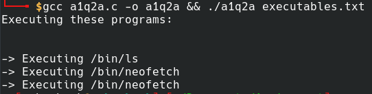

# OSWork

System Calls, Processes and Threads

### How to setup
Clone and run make

```
> git clone https://github.com/ianwright27/OSWork.git
> make
> cd bin
> ls
```

### Output:
```
Question1 Question2 Question3
```

## Bugs/Deviation that couldn't be resolved

### 2
Upon trying to achieve parallel program executing with **fork(), exec() and wait()** system calls, there is a certain misbehaviour caused by fork(). On examining the problem, especially when I used **fork() in a loop**, it will replicate the entire process. 
Using it in loops can be confusing, I forked in every instance of the loops while calling exec() in the child process.
The list of executables, are stored in **"executables.txt"** file. 
Reduced the number of programs to 2 programs in order to debug.
After running, I noticed "/bin/neofetch" (for example) will be executed twice as seen below.



### 3
Segmentation Fault. On trying to capture the system arguments, nothing is printed out even though the syntax is correct.
If that is not the problem then maybe it is in the use of Mutexes.

